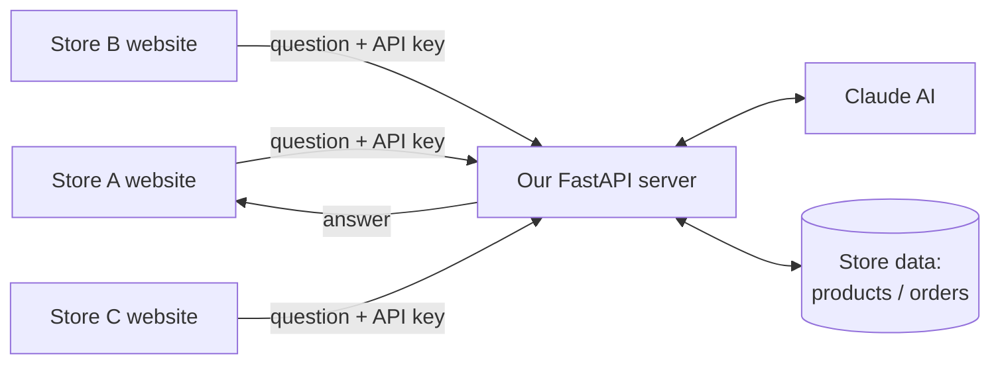
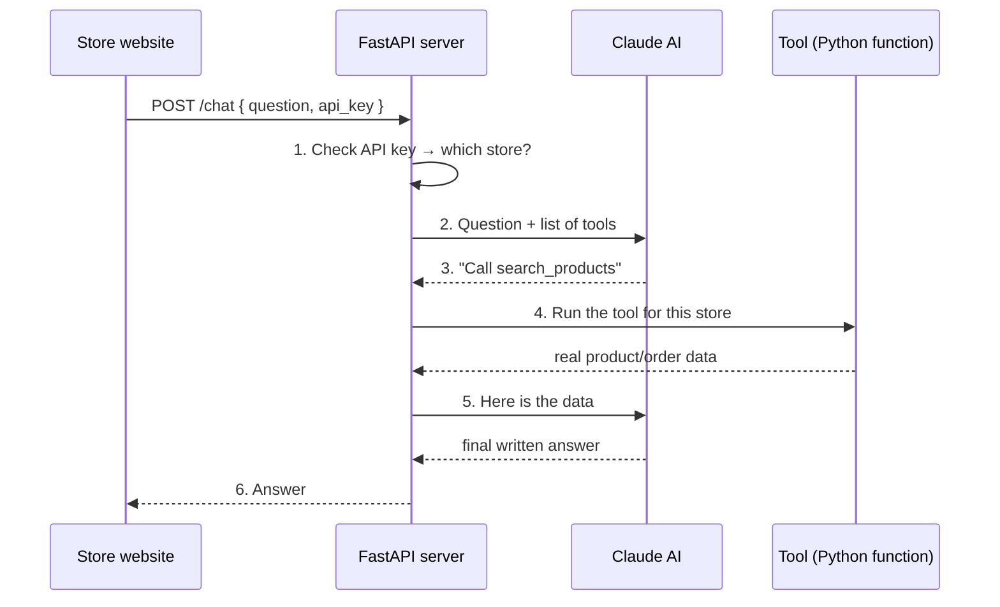
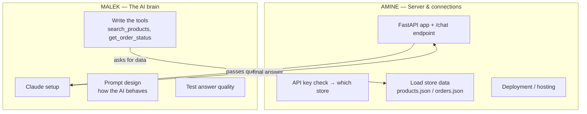
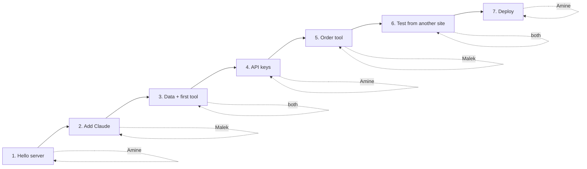

# E-commerce AI Assistant (AI part only)

We are building **only the AI brain**: a server that answers shopping questions for
online stores. Any store can connect to it by calling our API with their own key.

We are NOT building the store websites, billing dashboards, or payment systems.
We build one AI service; other sites plug into it.

Built with **Python + FastAPI**.

---

## 1. What it does (in plain words)

A customer on some online store types: *"Do you have this shirt in red? Where is my
order #123?"*

That question is sent to **our server**. Our server asks Claude (the AI). Claude figures
out what the customer needs, fetches the real data (products, order status), and writes
a clear answer. The answer goes back to the store's website.

Every store that uses us gets an **API key** — a secret password. The key tells us:
- *which* store is asking
- *whose* products and orders to look at

So Store A's customers never see Store B's data.

**Golden rule:** the AI never makes up prices, stock, or order info. It only reports what
our code actually fetched. This stops it from lying to customers.

---

## 2. How a store connects (the flow)

The big picture — many stores, one AI server:



Step by step, what happens for ONE question:



A "tool" is just a **Python function you write**. Claude decides *when* to call it; your
code decides *what it does*.

---

## 3. The main parts to build

| Part | What it is | Beginner note |
|---|---|---|
| **FastAPI app** | The web server that receives requests | One `main.py` to start; add routes as you grow |
| **/chat endpoint** | Where stores send questions | Takes JSON `{question, api_key}`, returns an answer |
| **API key check** | Confirms who is calling | Store keys in a dict/DB; look them up on every request |
| **Claude client** | Talks to the AI | Use the `anthropic` Python package |
| **Tools** | Python functions Claude can call | Start with `search_products`, `get_order_status` |
| **Store data source** | Where product/order info comes from | Start with a fake/sample store (JSON file) |

---

## 4. The tools (start with these two)

1. **`search_products(store_id, query)`**
   Finds products matching what the customer asked about.
   *MVP version:* search a JSON file of sample products. *Later:* real store data.

2. **`get_order_status(store_id, order_id)`**
   Looks up an order and returns its status.
   *MVP version:* read from a sample orders file. *Later:* call the real store's API.

Later you can add: `get_recommendations`, `escalate_to_human` (hand off to real support).

---

## 5. How different sites give us their data

Every store's setup is different, so we support connecting in stages:

- **Phase 1 (easiest):** the store sends us their product list as a file (CSV/JSON) that
  we save. Simplest way to get started.
- **Phase 2:** the store gives us a URL (their own API), and our tool fetches data live
  from it.
- **Phase 3 (later):** ready-made connectors for popular platforms (Shopify, WooCommerce).

For the MVP, use **fake sample data** so you can build and test the AI without any real
store.

---

## 6. Recommended stack (Python)

| Need | Use | Why |
|---|---|---|
| Web server | **FastAPI** | Fast, easy, auto-generates API docs at `/docs` |
| Run the server | **Uvicorn** | The program that actually runs FastAPI |
| AI | **anthropic** package (Claude) | Handles tool-calling; use Sonnet for answers |
| Data (MVP) | **JSON files** | No database needed to start |
| Data (later) | **PostgreSQL + pgvector** | Real storage + smart product search |
| Env secrets | **python-dotenv** | Keep API keys out of your code |

Install to start:
```
pip install fastapi uvicorn anthropic python-dotenv
```

---

## 7. Team split — Amine & Malek

Think of the server as two halves that meet at the `/chat` endpoint.



**Amine — Server & connections**
Builds the FastAPI app, the `/chat` endpoint, API key checking, loading the store data
files, and deploying it online. *Owns: how requests come in and data is fetched.*

**Malek — The AI brain**
Sets up Claude, writes the tool functions, designs the prompt (how the AI talks and
behaves), and tests that answers are good. *Owns: how the AI thinks and replies.*

**Shared (agree on these together first):** the exact JSON shape of a request/response,
and the sample data format. Malek's tools call the data that Amine loads — so they must
agree on what a product and an order look like.

Simple rule to avoid stepping on each other:
- If it's about **receiving requests, keys, or files** → Amine.
- If it's about **Claude, tools, or wording** → Malek.

---

## 8. Step-by-step plan

Who does what each step:



**Step 1 — Hello server** *(Amine)*
Make a FastAPI app with a `/chat` endpoint that just echoes back the question. Confirm it
runs (`uvicorn main:app --reload`) and shows up at `http://localhost:8000/docs`.

**Step 2 — Add Claude** *(Malek)*
Send the question to Claude, return Claude's plain answer. No tools yet.

**Step 3 — Add sample data + one tool** *(both: Amine makes the data, Malek writes the tool)*
Create `products.json` (fake products). Add `search_products`. Let Claude call it.

**Step 4 — Add API keys** *(Amine)*
Require an API key on each request. Map each key to a store id. Reject bad keys.

**Step 5 — Add order tool** *(Malek)*
Create `orders.json`. Add `get_order_status`.

**Step 6 — Test from "another site"** *(both)*
Call your API from a separate script/page using an API key — this proves other sites can
connect.

**Step 7 — Deploy** *(Amine)*
Put it online (Render, Railway, or Fly.io) so real stores can reach it.

**Later:** real store data connectors, recommendations, human handoff, usage limits.
