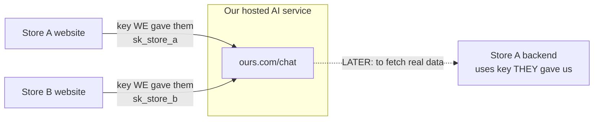
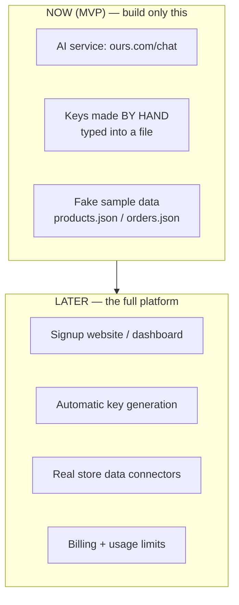
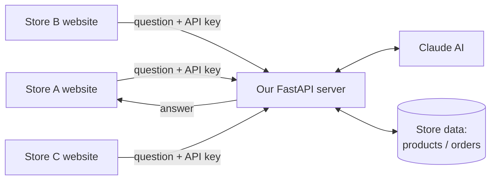
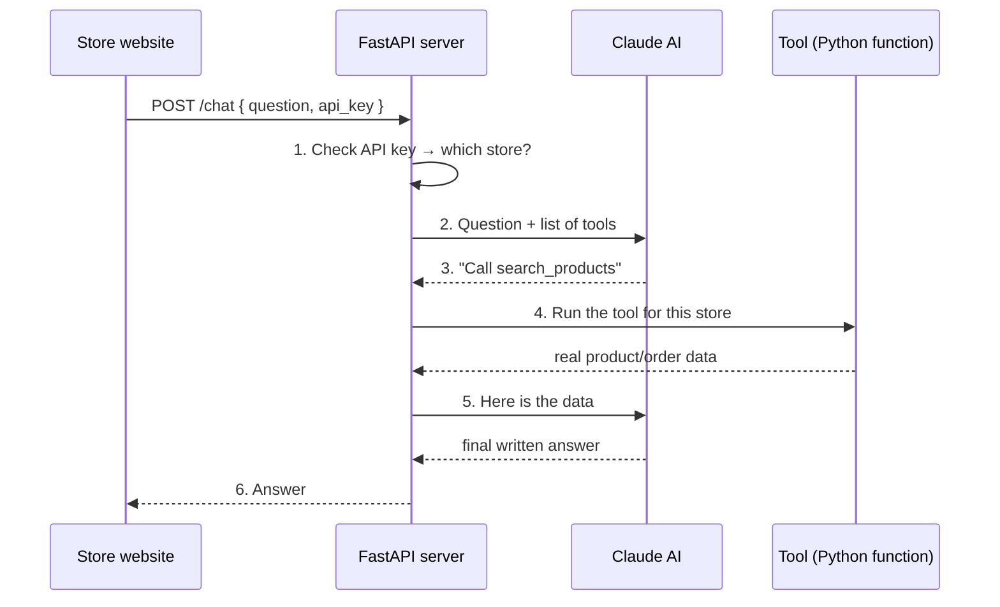
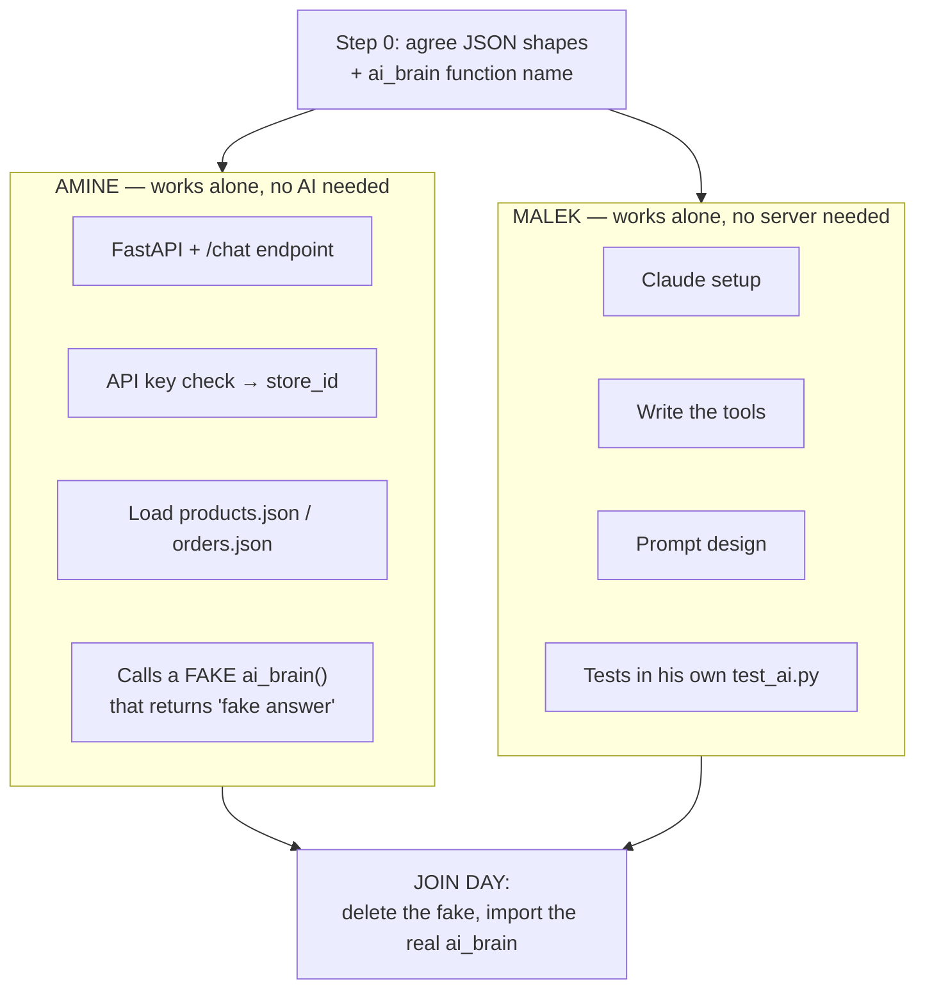
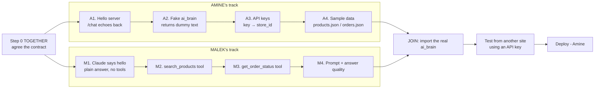

/# E-commerce AI Assistant (AI part only)

We are building **only the AI brain**: a server that answers shopping questions for
online stores. Any store can connect to it by calling our API with their own key.

We are NOT building the store websites, billing dashboards, or payment systems.
We build one AI service; other sites plug into it.

Built with **Python + FastAPI**.

---

## 1. What it does (in plain words)

A customer on some online store types: *"Do you have this shirt in red? Where is my
order #123?"*

That question is sent to **our server**. Our server asks Claude (the AI). Claude figures
out what the customer needs, fetches the real data (products, order status), and writes
a clear answer. The answer goes back to the store's website.

Every store that uses us gets an **API key** — a secret password. The key tells us:
- *which* store is asking
- *whose* products and orders to look at

So Store A's customers never see Store B's data.

**Golden rule:** the AI never makes up prices, stock, or order info. It only reports what
our code actually fetched. This stops it from lying to customers.

---

## 2. Two different API keys — don't mix them up

This confuses everyone at first. There are **two** keys, going in **opposite directions**.



**Key 1 — the key WE give THEM** *(needed now)*
- **We** create it. **We** hand it to the store owner.
- It's a password meaning "this store is allowed to use our AI."
- Each store gets its own: Store A → `sk_store_a`, Store B → `sk_store_b`.
- They send it with every request. It tells us *which store is asking*.

**Key 2 — the key THEY give US** *(only needed later)*
- Comes from **their** backend (Shopify, WooCommerce, or their own site).
- Lets **our** code fetch **their** real products and orders.
- **Not needed for the MVP** — we use fake JSON files instead.

**So: do all stores connect to the same API?** → **Yes.** One server, one URL. Everyone
calls `POST https://ourai.com/chat`. What differs is the **key** inside each request:

```
Store A sends:  { "question": "...", "api_key": "sk_store_a" }
Store B sends:  { "question": "...", "api_key": "sk_store_b" }
        ↓ same server, same URL
   We read the key → load THAT store's products/orders only
```

---

## 3. What we build NOW vs LATER

A full "platform" means a website where store owners sign up, get keys automatically,
upload products, and see billing. **We are not building that yet.**



| Stage | What exists | Who makes the key |
|---|---|---|
| **MVP (now)** | Just the AI API, hosted | **Us**, by hand, in the code |
| **Platform (later)** | Signup site + dashboard | The store owner, automatically |

MVP goal, in one line: **build the API, host it, hand out keys ourselves.**

---

## 4. How a store connects (the flow)

The big picture — many stores, one AI server:



Step by step, what happens for ONE question:



A "tool" is just a **Python function you write**. Claude decides *when* to call it; your
code decides *what it does*.

---

## 5. The main parts to build

| Part | What it is | Beginner note |
|---|---|---|
| **FastAPI app** | The web server that receives requests | One `main.py` to start; add routes as you grow |
| **/chat endpoint** | Where stores send questions | Takes JSON `{question, api_key}`, returns an answer |
| **API key check** | Confirms who is calling | Store keys in a dict/DB; look them up on every request |
| **Claude client** | Talks to the AI | Use the `anthropic` Python package |
| **Tools** | Python functions Claude can call | Start with `search_products`, `get_order_status` |
| **Store data source** | Where product/order info comes from | Start with a fake/sample store (JSON file) |

---

## 6. The tools (start with these two)

1. **`search_products(store_id, query)`**
   Finds products matching what the customer asked about.
   *MVP version:* search a JSON file of sample products. *Later:* real store data.

2. **`get_order_status(store_id, order_id)`**
   Looks up an order and returns its status.
   *MVP version:* read from a sample orders file. *Later:* call the real store's API.

Later you can add: `get_recommendations`, `escalate_to_human` (hand off to real support).

---

## 7. How different sites give us their data

Every store's setup is different, so we support connecting in stages:

- **Phase 1 (easiest):** the store sends us their product list as a file (CSV/JSON) that
  we save. Simplest way to get started.
- **Phase 2:** the store gives us a URL (their own API), and our tool fetches data live
  from it.
- **Phase 3 (later):** ready-made connectors for popular platforms (Shopify, WooCommerce).

For the MVP, use **fake sample data** so you can build and test the AI without any real
store.

---

## 8. Recommended stack (Python)

| Need | Use | Why |
|---|---|---|
| Web server | **FastAPI** | Fast, easy, auto-generates API docs at `/docs` |
| Run the server | **Uvicorn** | The program that actually runs FastAPI |
| AI | **anthropic** package (Claude) | Handles tool-calling; use Sonnet for answers |
| Data (MVP) | **JSON files** | No database needed to start |
| Data (later) | **PostgreSQL + pgvector** | Real storage + smart product search |
| Env secrets | **python-dotenv** | Keep API keys out of your code |

Install to start:
```
pip install fastapi uvicorn anthropic python-dotenv
```

---

## 9. Team split — Amine & Malek (working in parallel)

### Step 0 — do this TOGETHER first (~30 min)

Neither of us can work alone until we agree on the **contract**. Write it down, then don't
change it without telling the other person.

**The request / response shape:**
```json
// what a store sends TO /chat
{ "question": "Do you have red shirts?", "api_key": "sk_store_a" }

// what our server sends back
{ "answer": "Yes, we have 3 red shirts in stock..." }
```

**The data shape:**
```json
// products.json
{ "id": "p1", "name": "Red Shirt", "price": 20, "stock": 5 }

// orders.json
{ "id": "123", "status": "shipped", "items": ["Red Shirt"] }
```

**The handshake function** — the one line where our two halves meet:
```python
ai_brain(question, store_id) -> str
```
Amine calls it. Malek writes it. That's the whole interface.

### The parallel trick: each of us FAKES the other's side



**Amine does NOT wait for the AI.** He puts a fake in his own file:
```python
def ai_brain(question, store_id):
    return "fake answer for now"   # Malek's real version replaces this later
```
With this, he can fully build and test the server, keys, and data loading.

**Malek does NOT wait for the server.** He tests the AI directly in his own script:
```python
# test_ai.py — run with: python test_ai.py
from ai_brain import ai_brain
print(ai_brain("Do you have red shirts?", "store_a"))
```
He uses the same `products.json` shape agreed in Step 0.

**Join day:** Amine deletes his fake and writes `from ai_brain import ai_brain`. Because
both followed the contract, it just plugs in.

### Who owns which files (never edit the other person's files)

| File | Owner | What's in it |
|---|---|---|
| `main.py` | **Amine** | FastAPI app, `/chat` endpoint |
| `keys.py` | **Amine** | API key → store_id mapping (hand-written keys) |
| `data.py` | **Amine** | Loads the JSON files for a given store |
| `products.json`, `orders.json` | **Amine** | Fake sample data |
| `ai_brain.py` | **Malek** | Claude client, the agent loop, prompt |
| `tools.py` | **Malek** | `search_products`, `get_order_status` |
| `test_ai.py` | **Malek** | His own AI testing script |

Simple rule to avoid conflicts:
- **Requests, keys, files, hosting → Amine.**
- **Claude, tools, prompts, answer quality → Malek.**

### What each person already knows

Amine built AI into a todo app; Malek built AI into a pharmacy store. Both have done
"call an AI, feed it app data, show the answer." Only two things are genuinely new:

1. **Tool-calling** — the AI *asks* for data by calling a function, instead of being
   handed it. (Malek's part.)
2. **Multi-store + keys** — serving many stores instead of one app. (Amine's part.)

---

## 10. Step-by-step plan

Two tracks running at the same time, joining at the end:



**Step 0 — the contract** *(together)*
Agree the request/response JSON, the data shape, and the `ai_brain(question, store_id)`
signature. See section 9.

### Amine's track (can start immediately)

**A1 — Hello server.** FastAPI app with a `/chat` endpoint that echoes the question back.
Run it: `uvicorn main:app --reload`, check `http://localhost:8000/docs`.

**A2 — Fake AI.** Add a local `ai_brain()` that returns dummy text, and call it from
`/chat`. Now the whole request path works end to end.

**A3 — API keys.** Require `api_key` on every request. Map keys → `store_id` in
`keys.py`. Reject unknown keys with a clear error.

**A4 — Sample data.** Write `products.json` and `orders.json` (in the Step 0 shape) and a
`data.py` with `get_products(store_id)` / `get_orders(store_id)`.

### Malek's track (can start immediately)

**M1 — Claude says hello.** In `ai_brain.py`, send the question to Claude and return the
plain answer. No tools yet. Test with `test_ai.py`.

**M2 — First tool.** Add `search_products` in `tools.py`. Give Claude the tool, let it
decide to call it, feed the result back, return the final answer.

**M3 — Second tool.** Add `get_order_status` the same way.

**M4 — Prompt + quality.** Write the system prompt: be friendly, never invent prices or
stock, say "I'll connect you to support" when unsure. Test ~10 sample questions.

### Together at the end

**Join.** Amine deletes his fake and imports Malek's real `ai_brain`. Fix any mismatch.

**Test from "another site."** Call the API from a separate script or HTML page using an
API key — this proves other websites can connect.

**Deploy** *(Amine)*. Put it online (Render, Railway, or Fly.io) so real stores can reach it.

**Later:** real store data connectors, recommendations, human handoff, usage limits.
